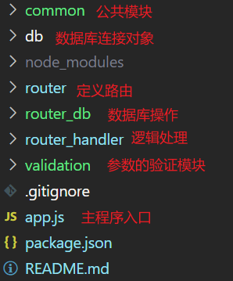

# sesys-back
供应商评价系统后端

## 项目结构

在后端路由部分，一共分为了三个层次来处理数据，每一层都专注于干自己的事情：

- `router`：定义路由
- `router-handel`：处理从db取回的数据，封装成需要的返回格式
- `router-db`：只进行数据库的操作，这里使用**Promise**封装了数据库的异步操作，使用`async await`就可以获取到结果，从回调函数中解放出来（promise真是太好用了）

## 需要注意的问题

**实现细节**

- 当一个供应商没有评价时应该怎么处理：当供应商的`avg_score`为空时，设置为`无评分`
- 当评价的分数不符合区间怎么处理：参数进行校验

**遇到的问题**

- 因为`mysql`模块的`db.query()`方法是异步方法，当把db操作单独封装成模块时，在`handler`中调用这些方法时，还没有返回数据，最后参数为`undefined`：用Promise封装`db.query`异步方法，同时在`handler`中用`await`和`async`来接受结果。==缺点：所有的promise中产生的错误都需要`try catch`来捕获，代码有些冗余==
- 请求没有传递接口定义的参数：使用`express-validator`中间件来实现参数的校验

